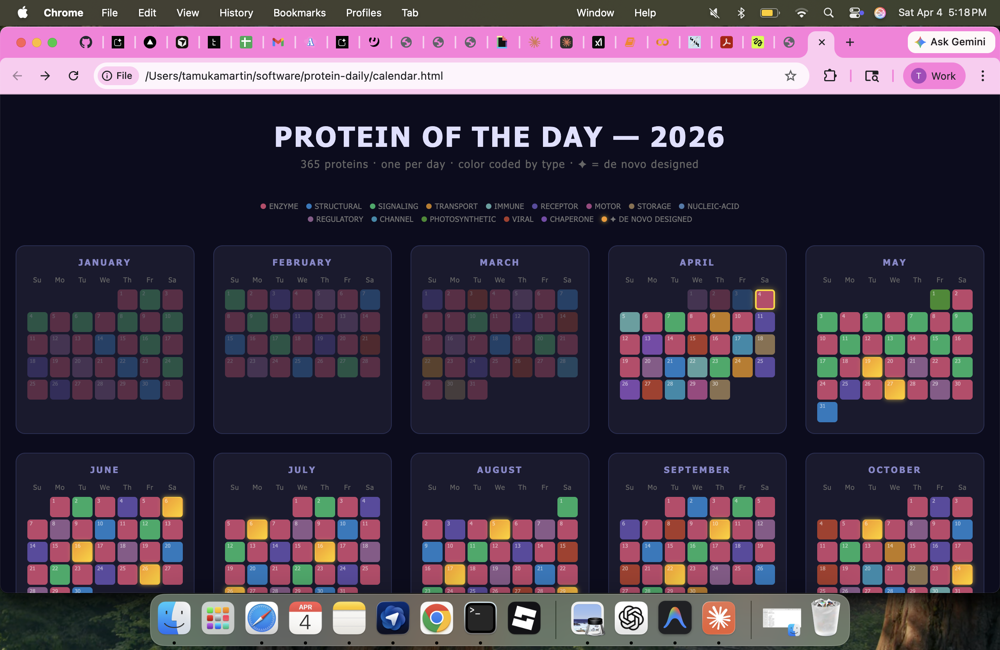

# Protein Daily

A daily protein structure viewer — one new protein every day of the year, rendered interactively in 3D. Built as a progressive web app with [Capacitor](https://capacitorjs.com/) for iOS/Android deployment.



## Features

- 365 curated proteins, one per day
- Interactive 3D structure viewer powered by [3Dmol.js](https://3dmol.csb.pitt.edu/)
- Multiple render styles (cartoon, surface, stick, sphere)
- Daily streak tracking
- Structures fetched live from [RCSB PDB](https://www.rcsb.org/)

## Running locally

```bash
bash start.sh
```

Opens at `http://localhost:3000`. The script builds the `www/` directory and starts a Python HTTP server.

## Project structure

```
├── index.html          # App shell
├── app.js              # Main application logic
├── proteins.js         # Curated list of 365 proteins
├── cache.js            # PDB structure caching
├── styles.css          # Styles
├── proteins.csv        # Protein data (source of truth)
├── vendor/
│   └── 3dmol-min.js   # Bundled 3Dmol.js
├── capacitor.config.json
└── start.sh            # Local dev server script
```

## Mobile (iOS / Android)

```bash
npm run sync        # Build and sync to native projects
npm run open:ios    # Open in Xcode
npm run open:android # Open in Android Studio
```

> `ios/` and `android/` are gitignored — run `npx cap add ios` / `npx cap add android` to regenerate.
